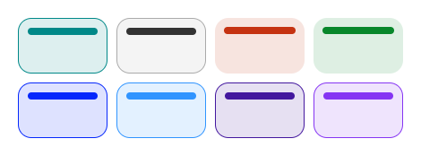

# Standard Atmosphere Calculator

A responsive web calculator that computes the atmospheric properties defined by U.S. Standard Atmosphere 1976 model between 0 and 86 km geometric altitude.

## Features

- Responsive design
- Light & dark mode
- Accurate implementation of the NASA U.S. Standard Atmosphere 1976 equations
- Geometric altitude input
- Automatic geopotential altitude conversion

## Themes




## Web

[sa-calculator](https://emanuel-va.github.io/sa-calculator/)

## Built with

- HTML5
- CSS3
- JavaScript ES6

## Workflow

### 1. User input:

Unlike many atmospheric calculators, this project uses ```Geometric Altitude``` as the input instead geopotential altitude, but in aerospace and aeronautical science is very common to work with geometric altitudes.

### 2. Validation:

Verifies if typed altitude is valid, this calculator uses linear gradients model, so it supports geometric altitudes from 0 to 86,000 m.

### 3. Geopotential conversion:

If geometric altitude value is valid, calculator converts it to geopotential altitude, this conversion allows gravitational acceleration to be treated as constant throug all atmosphere layers.

### 4. Layer selection:

When geopotential altitude is obtained, the calculator determines the corresponding atmospheric and retrieves its base molecular-scale temperature, pressure and temperature gradient.

### 5. Atmospheric equations:

Calculator uses U.S. Standard Atmosphere 1976 equations and constants for calculate all outputs.

### 6. Results:

Clicking ```Calculate``` returns all output values and displays them on output fields.

## Project structure

```text
.
├── assets
│   ├── fonts
│   │   ├── RobotoMono-Bold.ttf
│   │   └── RobotoMono-Regular.ttf
│   └── img
│       ├── mockups
│       │   ├── dark.png
│       │   └── light.png
│       └── favicon.svg
├── documents
│   └── data.md
├── scripts
│   ├── atmosphere.js
│   ├── data.js
│   └── main.js
├── styles
│   ├── fonts.css
│   └── style.css
├── index.html
├── LICENSE
└── README.md

8 directories, 14 files
```
## Future upgrades

- Unit conversion
- Language support
- Graphical atmosphere interface
- Keyboard shortcuts

## Development

This project was built from scratch as a personal learning project.

## License

[MIT](LICENSE)

## Constants & equations

To view detailed atmospheric model, click [here](documents/data.md).

## References

NASA

U.S. Standard Atmosphere 1976

PDF: [nasa.gov](https://ntrs.nasa.gov/api/citations/19770009539/downloads/19770009539.pdf)